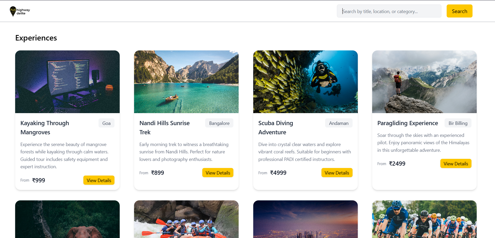
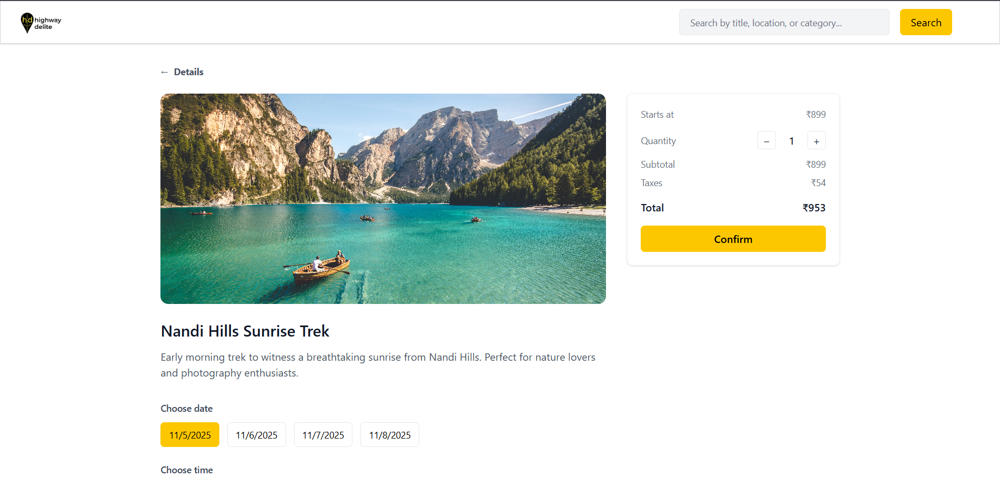
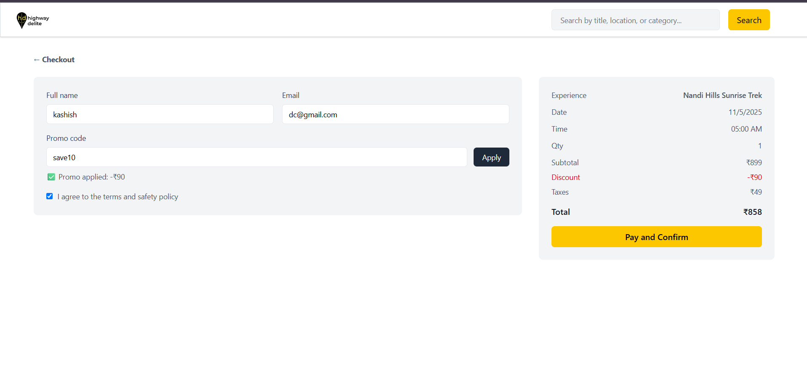
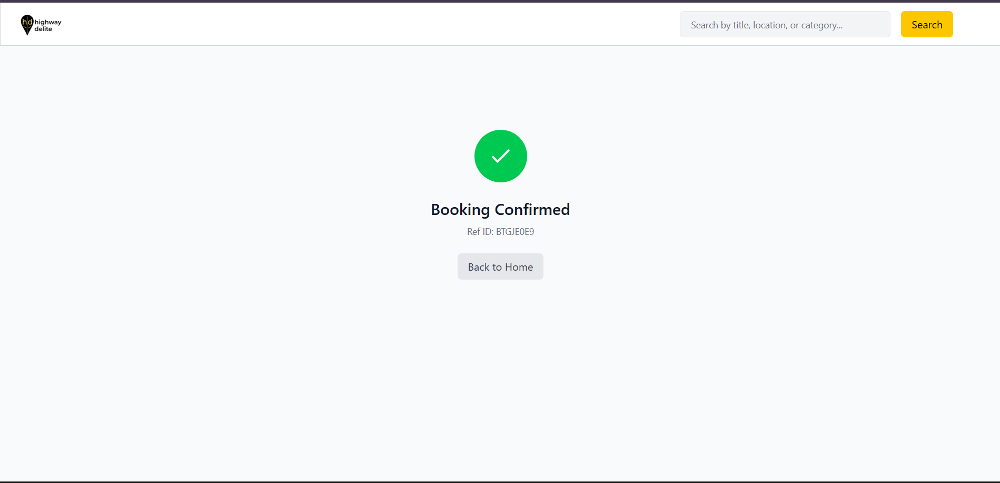

<div align="center">
  <h1>📚 BookIt</h1>
  <p><strong>A Modern Experience Booking Platform</strong></p>
  
  <p>
    
    
    
    
    
  </p>

  <p>
    <a href="#features">✨ Features</a> •
    <a href="#tech-stack">🛠️ Tech Stack</a> •
    <a href="#installation">⚡ Installation</a> •
    <a href="#api-routes">🔌 API Routes</a> •
    <a href="#contributing">🤝 Contributing</a>
  </p>
</div>

---

## 📖 About

**BookIt** is a modern experience booking platform that allows users to discover, book, and manage various adventure experiences. Built with cutting-edge web technologies, it features a seamless booking flow with slot management, promo code validation, and real-time availability tracking.

### 🎯 Key Highlights

- **Experience Discovery**: Browse and search through various adventure experiences
- **Smart Slot Management**: Real-time availability tracking with capacity management
- **Promo Code System**: Discount validation with percentage and fixed-value promos
- **Seamless Checkout**: Intuitive booking flow with customer details and payment summary
- **Booking Confirmation**: Unique reference ID generation for each booking
- **Responsive Design**: Mobile-first design with Tailwind CSS

---

## ✨ Features

### 🎫 Experience Management
- **Browse Experiences** with detailed information
- **Search Functionality** by title, location, or category
- **Experience Details** with pricing and availability
- **Slot-based Booking** with date and time selection
- **Capacity Tracking** to prevent overbooking

### 💳 Booking System
- **Interactive Checkout** with customer information
- **Dynamic Pricing** with tax calculations
- **Promo Code Validation** with discount application
- **Booking Confirmation** with unique reference IDs
- **Protected Routes** for secure confirmation pages

### 🎟️ Promo Code Features
- **Multiple Promo Types** (percentage & fixed discount)
- **Minimum Purchase** requirements
- **Maximum Discount** caps
- **Usage Limits** and tracking
- **Validity Period** checks
- **Real-time Validation** during checkout

---

## 📸 Screenshots

<div align="center">

### 🏠 Home


### ✍️ Details


### 📖 Checkout 


### 📱 Confirmation



</div>

---

## 🛠️ Tech Stack

<div align="center">

<table>
<tr>
<td width="50%">

### Frontend
| Technology | Version | Purpose |
|------------|---------|---------|
| **React** | 19.1.1 | UI Framework |
| **Vite** | 7.1.7 | Build Tool & Dev Server |
| **React Router** | 7.9.4 | Client-side Routing |
| **Axios** | 1.13.1 | HTTP Client |
| **Tailwind CSS** | 4.1.16 | Utility-first CSS |

</td>
<td width="50%">

### Backend
| Technology | Version | Purpose |
|------------|---------|---------|
| **Node.js** | Latest | Runtime Environment |
| **Express.js** | 5.1.0 | Web Framework |
| **MongoDB** | Latest | Database |
| **Mongoose** | 8.19.2 | ODM |
| **CORS** | 2.8.5 | Cross-Origin Requests |

</td>
</tr>
</table>

</div>

---

## 🚀 Installation

### Prerequisites
- **Node.js** (v16 or higher)
- **MongoDB** (local or cloud)
- **Git**

### 1. Clone the Repository
```bash
git clone https://github.com/kashishchadha/BookIt.git
cd BookIt
```

### 2. Backend Setup
```bash
cd backend
npm install
```

Create a `.env` file in the backend directory:
```env
MONGODB_URI=your_mongodb_connection_string
PORT=3000
```

Seed the database with sample data:
```bash
npm run seed
```

Start the backend server:
```bash
npm run dev
```

### 3. Frontend Setup
```bash
cd ../client
npm install
```

Update the API base URL in `client/src/services/api.js` if needed:
```javascript
const API_BASE_URL = 'http://localhost:3000/api'
```

Start the frontend development server:
```bash
npm run dev
```

### 4. Access the Application
- **Frontend**: http://localhost:5173
- **Backend API**: http://localhost:3000

---

## 🔌 API Routes

### Experience Routes (`/api/experiences`)
- `GET /` - Get all active experiences
- `GET /:id` - Get specific experience with available slots

### Booking Routes (`/api/bookings`)
- `POST /` - Create new booking
- `GET /:refId` - Get booking by reference ID

### Promo Routes (`/api/promo`)
- `POST /validate` - Validate promo code and calculate discount

---

## 📁 Project Structure

```
BookIt/
├── client/                   # React frontend application
│   ├── src/
│   │   ├── components/       # Reusable UI components
│   │   │   ├── Navbar.jsx    # Navigation with search
│   │   │   ├── Card.jsx      # Experience card component
│   │   │   ├── MainLayout.jsx # App layout wrapper
│   │   │   └── ProtectedRoute.jsx # Route protection
│   │   ├── pages/            # Page components
│   │   │   ├── MainPage.jsx  # Experience listing
│   │   │   ├── Details.jsx   # Experience details & slot selection
│   │   │   ├── Checkout.jsx  # Booking checkout
│   │   │   └── Confirmation.jsx # Booking confirmation
│   │   ├── services/         # API integration
│   │   │   └── api.js        # Axios configuration & endpoints
│   │   ├── App.jsx           # Main app component
│   │   └── main.jsx          # App entry point
│   └── package.json          # Frontend dependencies
│
├── backend/                  # Express.js backend API
│   ├── models/               # MongoDB models
│   │   ├── Experience.js     # Experience & Slot schema
│   │   ├── Booking.js        # Booking schema
│   │   └── Promo.js          # Promo code schema
│   ├── routes/               # API routes
│   │   ├── experiences.js    # Experience routes
│   │   ├── bookings.js       # Booking routes
│   │   └── promo.js          # Promo code routes
│   ├── utils/                # Utilities
│   │   └── connectDB.js      # MongoDB connection
│   ├── scripts/              # Database scripts
│   │   └── seed.js           # Data seeding script
│   ├── index.js              # Server entry point
│   └── package.json          # Backend dependencies
│
└── README.md                 # Project documentation
```

---

## 🎨 Scripts

### Frontend
```bash
npm run dev      # Start development server
npm run build    # Build for production
npm run preview  # Preview production build
npm run lint     # Run ESLint
```

### Backend
```bash
npm run dev      # Start development server with watch mode
npm run seed     # Seed database with sample data
```

---

## 🌟 Key Features Breakdown

### 📅 Slot Management System
- Dynamic slot creation with date and time
- Real-time capacity tracking
- Automatic availability checks
- Prevent overbooking with capacity limits

### 🎟️ Advanced Promo System
- **Percentage Discounts**: With maximum discount caps
- **Fixed Amount Discounts**: Direct price reduction
- **Validation Rules**:
  - Active status check
  - Date validity (validFrom to validUntil)
  - Usage limit enforcement
  - Minimum purchase requirements
- **Real-time Calculation**: Instant discount application

---


## 📞 Contact

**Kashish Chadha**
- GitHub: [@kashishchadha](https://github.com/kashishchadha)
- Project Link: [https://github.com/kashishchadha/BookIt](https://github.com/kashishchadha/BookIt)

---


<div align="center">
  <p>Made with ❤️ by <a href="https://github.com/kashishchadha">Kashish Chadha</a></p>
  <p>⭐ Star this repo if you find it helpful!</p>
</div>
